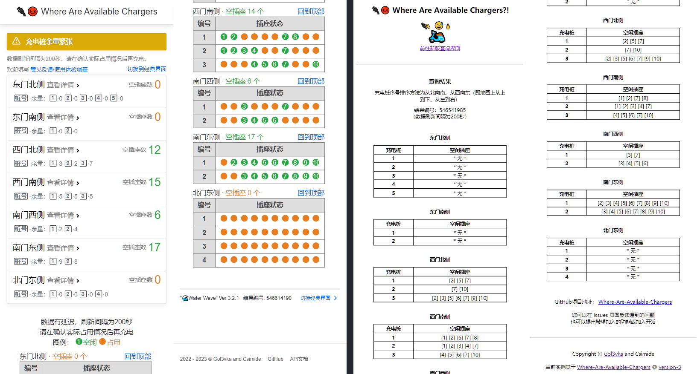
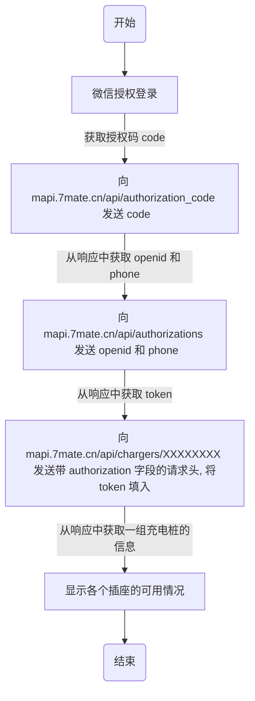

# :electric_plug::rage:Where Are Available Chargers?

---

## 查询网址：<http://chargers.injs.eu>

:wave: 由于获取到了正式的接口，本分支所使用的数据获取方式**不再使用**，且本分支中的前端是老版本的，新的数据获取方式和前端代码可移步 [`main`](https://github.com/Golevka2001/Where-Are-Available-Chargers/tree/main) 查看。



这是一个用来查询校园内各个充电桩的使用情况的小工具，希望它可以帮您更方便给小电驴找到充电桩。

如果它对您有帮助的话，可以点击右上角的 :star:**Star** 按钮，感谢您的支持！ :tada::tada::tada:

## 目录

- [:electric\_plug::rage:Where Are Available Chargers?](#electric_plugragewhere-are-available-chargers)
  - [查询网址：http://chargers.injs.eu](#查询网址httpchargersinjseu)
  - [目录](#目录)
  - [背景](#背景)
  - [工作流程](#工作流程)
  - [使用说明](#使用说明)
    - [下载 \& 解压](#下载--解压)
    - [项目结构](#项目结构)
    - [配置 Python 环境](#配置-python-环境)
    - [创建虚拟环境（可选）](#创建虚拟环境可选)
    - [安装依赖库](#安装依赖库)
    - [运行](#运行)
  - [反馈与建议](#反馈与建议)
  - [致谢](#致谢)
  - [更新日志](#更新日志)
  - [使用许可](#使用许可)

## 背景

电瓶不让拎进宿舍之后只能去充电桩那儿充电了，之前有过好几次去的时候各个充电桩都插得满满当当，没地儿充又骑回去了。

后来想了个法，把二维码拍下来存手机相册里，要充电的时候提前扫一下。挺聪明的，不过还是麻烦，而且有时候会忘了哪个码是哪个桩子的。

:rage: 然后就有了这个小脚本。

## 工作流程



## 使用说明

***注：本部分内容面向有在本地构建项目的需求的用户。
如果您只想查询数据，请直接访问本文档最上方提供的网址。***

本项目使用 Python 编写，依赖 aiohttp 库异步爬取数据、使用 flask 框架构建 web 服务。

### 下载 & 解压

点击右上方的绿色 ```Code``` 按钮，在下拉菜单中点击 ```Download ZIP```
下载完成后，把它解压到你想要的位置。

### 项目结构

```bash
Where-Are-Available-Chargers
├── config.yml              # 配置文件，包含url、请求头等信息
├── example_response.json   # 一个响应的例子
├── find_chargers.py        # FindChargers 类，执行请求、获取结果的主要实现
├── requirements.txt        # 依赖库
├── server.py               # 构建 web 服务
├── static                  # 静态资源目录
│   ├── css
│   │   └── style.css
│   ├── favicon.ico
│   └── js
│       ├── clear.js
│       ├── index.js
│       └── loading.js
└── templates               # 模板目录
    ├── error.html
    ├── index.html
    └── loading.html
```

### 配置 Python 环境

略。

### 创建虚拟环境（可选）

创建虚拟环境：

```bash
cd /path/to/Where-Are-Available-Chargers
python -m venv waac-venv
```

### 安装依赖库

激活虚拟环境（可选）：

```bash
.\waac-venv\Scripts\activate
```

安装依赖库：

```bash
pip install .\requirements.txt
```

### 运行

在编译器里运行，或者在脚本所在路径下进入终端输入以下命令：

*（注：如创建了虚拟环境需要在激活虚拟环境后运行）*

```bash
python .\server.py
```

在浏览器中访问 ```http://127.0.0.1:3000``` 查看页面。

## 反馈与建议

如在使用中遇到什么问题（如：数据获取不及时、网页无法打开、响应慢等），或想要提出一些改进建议、新功能，欢迎通过以下方式反馈：

- 点击页面上方的 [**Issues**](https://github.com/Golevka2001/Where-Are-Available-Chargers/issues) 提交；
- 通过**邮件**发送到 <gol3vka@163.com>。

感谢您的帮助与支持！

## 致谢

在这里特别感谢 [@csimide](https://github.com/csimide) 提供了现在使用的域名、服务器，以及共同开发。

:rose::rose::rose:

## 更新日志

**2023-05-11:**

1. 拿到正式接口，旧的数据获取方式不再使用；
2. 分支调整：原 `main` 分支迁移到 `deprecated`，不再更新。

**2023-04-09:**

1. 同步充电桩布局调整：包括北门新增6个，南门东侧2个移至东门北侧（现1、2）。

**2023-03-23:**

1. 全新界面样式（by [@csimide](https://github.com/csimide)）。新版本相关代码将会放在新的分支 [`version-3`](https://github.com/Golevka2001/Where-Are-Available-Chargers/tree/version-3)。

**2022-11-16:**

1. 新增加载页面、错误页面；
2. 改为异步请求；
3. 超时与异常处理。

**2022-11-15:**

1. 新增南门充电桩（在校外）4个。

**2022-11-10:**

1. ~~新增剩余时间和完成百分比的显示；~~（无法做到准确，暂时弃用）
2. 改为多线程发送请求。

**2022-11-07:**

1. 修改时间显示为本地时间（UTC+08:00）。

**2022-11-06:**

1. 新增刷新加载页面；
2. 修改缓存更新逻辑。

**2022-11-04:**

1. 有域名啦！非常感谢 [@csimide](https://github.com/csimide) 提供的域名与服务器！！！；
2. 更新了西门北侧的充电桩（3个）、北门东侧的充电桩（4个）。学校里目前的充电桩应该就这些了吧，如果还有别的地方有可以反馈给我噢；
3. 修改后端刷新逻辑，目前设置了最小刷新间隔为 5min（可能会根据使用情况再调整）。

**2022-11-03:**

1. 搭建了网页！只差个服务器啦，目前先在自己电脑上跑着吧；
2. 更新了东门南侧的充电桩（2个）。

**2022-11-03:**

1. 更新了东门北侧的充电桩（5个）。

**2022-11-02:**

1. 目前只是在本地运行显示，之后可能会对接到公众号或者其他方式来方便查询，还没想好；
2. 目前可查询的充电桩：西门南侧（3个）~~和一个忘了是哪的充电桩~~。

## 使用许可

[GNU GENERAL PUBLIC LICENSE v2.0 © Gol3vka.](./LICENSE)
